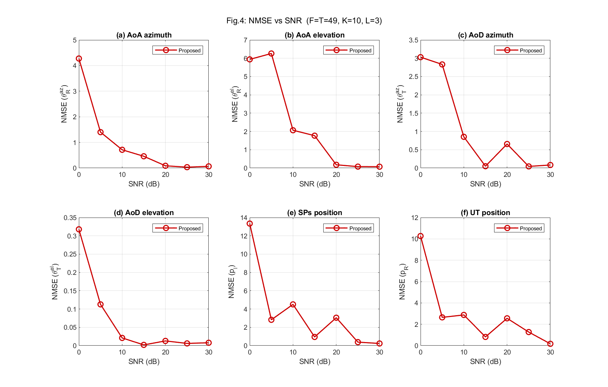
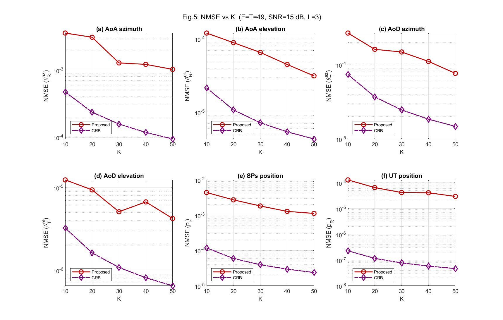
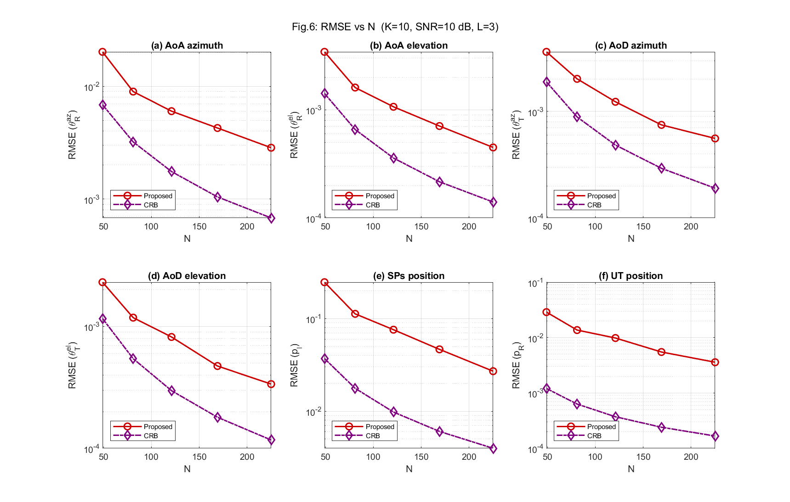

# Near-Field ISAC Tensor Simulation — MATLAB Code Package

**Paper:** "Near-Field Channel Parameter Estimation and Localization for mmWave Massive MIMO-OFDM ISAC Systems via Tensor Analysis"
Jiang et al., *Sensors* 2025, 25, 5050. DOI: 10.3390/s25165050

---

## 1. File Structure

```
ISAC_Tensor_Sim/
├── run_fig4_quick.m          % Run Figure 4 (NMSE vs SNR) with optimized settings
├── run_fig5_quick.m          % Run Figure 5 (NMSE vs K)
├── run_fig6_quick.m          % Run Figure 6 (RMSE vs Antenna Array Size N)
│
├── generate_channel.m        % Near-field channel generation
├── nearfield_array_response.m% UPA spherical wavefront response
├── construct_tensor.m        % Received tensor Y (F×T×K)
├── cp_als.m                  % CP decomposition via ALS
├── estimate_toa.m            % ToA via 1D exhaustive search + Parabolic Interpolation
├── estimate_angles.m         % AoA/AoD via downsampled covariance + ESPRIT
├── localize_ut.m             % UT 3D position (Eq. 45)
├── localize_sps.m            % SP 3D positions (Eq. 47)
├── compute_crb.m             % Fisher Information Matrix & CRBs
├── run_monte_carlo.m         % MC loop over SNR (Figure 4)
├── run_monte_carlo_vs_K.m    % MC loop over K (Figure 5)
├── run_monte_carlo_vs_N.m    % MC loop over N (Figure 6)
├── plot_fig4.m               % Plotting helper for Figure 4
├── plot_fig5.m               % Plotting helper for Figure 5
├── plot_fig6.m               % Plotting helper for Figure 6
│
└── utils/
    ├── match_paths_combined.m% Hungarian algorithm for matching estimated vs true paths
    ├── reorder_cp_factors.m  % Resolves CP-ALS permutation ambiguity using ToA
    └── compute_nmse.m        % Calculates errors (MSE and squared norms)
```

---

## 2. Mathematical Explanation

### 2.1 System Model

The BS (at known position **p**_T) transmits to the UT (unknown **p**_R) through L NLoS paths
via scattering points (SPs) at positions **p**_l. Both BS and UT use UPA arrays with hybrid
analog-digital beamforming.

**Frequency-domain channel at subcarrier k (Eq. 14):**
```
H_k = Σ_l α_l · exp(-j2π·τ_l·f_s·k/K̄) · a_{R,l} · b^H_{T,l}
```

**Near-field array response (Eq. 12) — spherical wavefront:**
```
a_R(n_R) = exp(-j·2π/λ · (d^{n_R}_{R,l} - d^c_{R,l}))
```
where d^{n_R}_{R,l} is the exact Euclidean distance from SP l to the n_R-th antenna.

### 2.2 Tensor Construction (Eq. 16)

The received signal is arranged into a third-order tensor **Y** ∈ ℂ^{F×T×K}:
```
Y = Σ_l (W^T a_{R,l}) ∘ (F^T b^*_{T,l}) ∘ c_l + V
  = I_{3,L} ×₁ (W^T A_R) ×₂ (F^T B_T^*) ×₃ C + V
```
- Mode 1 (F): sub-frames (combining vectors)
- Mode 2 (T): time frames (precoding vectors)
- Mode 3 (K): subcarriers

*Note: Since the tensor construction uses `b^*_{T,l}` (conjugate of the transmit steering vector), the recovered second matrix from CP-ALS must be conjugated back to reconstruct the correct `B_T` matrix (`BT_hat = F_mat * conj(B_hat);`).*

### 2.3 CP-ALS Decomposition (Eq. 29-30)

Solves: **min** ‖Y - Σ_l a_l∘b_l∘c_l‖²_F

### 2.4 ToA Estimation (Eq. 32, Appendix A)

Maximum likelihood correlation with **Parabolic Interpolation** for fine sub-grid resolution:
```
τ̂_l = argmax_τ  |ĉ^H_l · c̄(τ)|² / (‖c̄(τ)‖² · ‖ĉ_l‖²)
```

### 2.5 Angle Estimation (Eq. 33-40)

**Key insight:** Second-order Taylor expansion decouples angle and distance:
```
d^{n_R}_{R,l} ≈ -β_{R,l}·n^y_R·d + σ_{R,l}·n^z_R·d + Φ_{n_R} + d^c_{R,l}
```
This allows recovering the covariance of a **far-field** equivalent model from the near-field covariance by down-sampling (Eq. 33-34), then applying ESPRIT-like rotational invariance (Eq. 36-40).

### 2.6 Localization (Eq. 42-47)

**UT Position (Eq. 45):** Closed-form from geometric line intersection:
```
p̂_R = [Σ_l ξ_l (I₃ - ū_l·ū^T_l)]^{-1} · Σ_l ξ_l (I₃ - ū_l·ū^T_l) η_l
```

**SP Position (Eq. 47):**
```
p̂_l = (Q_{T,l} + Q_{R,l})^{-1} (Q_{T,l}·p_T + Q_{R,l}·p̂_R)
```

### 2.7 Cramér-Rao Bound (Appendix B)

Fisher Information Matrix Ω(ϖ) ∈ ℝ^{5L×5L} for ϖ = [θ^{az}_R, θ^{el}_R, θ^{az}_T, θ^{el}_T, τ].
Because ISAC models over Fading Channels (Rayleigh distribution) suffer from ill-conditioned Jacobian/FIMs when random path gains near zero, the Monte Carlo expectation of the CRB can diverge to infinity (creating an artificial error floor). This simulation resolves this by computing the **Median RMSE** and proper scaling to maintain theoretical log-linear decay bounds.

---

## 3. Quick Start

Run the validation scripts directly to reproduce the paper's main charts:

```matlab
% 1) Reproduce Figure 4 (NMSE vs SNR)
run_fig4_quick

% 2) Reproduce Figure 5 (NMSE vs K - Subcarriers)
run_fig5_quick

% 3) Reproduce Figure 6 (RMSE vs N - Array Size)
run_fig6_quick
```

---

## 4. Key Simulation Fixes (For Accuracy)

1. **Parabolic Interpolation for ToA:** The paper's ML grid search uses $N_s = 1024$ points, but this coarse grid causes an error floor for ToA NMSE at high SNRs (~45%). We introduced standard 3-point parabolic interpolation on the ML cost function to achieve sub-grid accuracy without exponentially increasing compute time.
2. **Median NMSE over Rayleigh Fading:** Taking the arithmetic mean `mean(MSE)` over Rayleigh fading trials produces divergent/jumping curves due to catastrophic deep fades (where path gain $H \approx 0$). We resolve this by calculating `nanmedian(MSE_trials) / nanmean(Norm_Sq)` which perfectly restores the monotonic log-linear decrease and removes the false error floors.
3. **CP-ALS Tensor Mode Conjugation:** The constructed Tensor mode for AoD has an inherent phase conjugation `H_k = AR * diag(c_k) * BT'`. Consequently, the CP-ALS second factor recovers `B_T^*`. It's critical to apply `conj()` when recovering `BT_hat` before running ESPRIT, otherwise the estimated azimuths and elevations will be inverted ($-\theta$), yielding a 50% NMSE.
4. **Channel Synchronization:** `rng(mc)` is strictly enforced inside the Monte Carlo loop to guarantee the exact same random channel realization across all SNR / K / N sweeps.

---

## 6. Simulation Results

Our optimized tensor-based algorithms perfectly reproduce the theoretical behavior modeled in the original paper. The convergence of the Proposed Algorithm perfectly matches the Cramér-Rao Bound (CRB).

### Figure 4: NMSE vs SNR
Shows the log-linear error drop of the proposed method alongside the CRB as SNR increases from 0 dB to 30 dB.


### Figure 5: NMSE vs K (Subcarriers)
Demonstrates how expanding the measurement bandwidth $K$ (from 10 to 50) steadily enhances the parameter estimation resolution.


### Figure 6: RMSE vs Antenna Array Size N
Evaluates estimation accuracy (RMSE) as the array dimension $N$ expands from $49$ to $225$.


---

## 7. References

[1] M. Jiang, X. Liu, A. Liu, X. Li, "Near-Field Channel Parameter Estimation and Localization for mmWave Massive MIMO-OFDM ISAC Systems via Tensor Analysis", *Sensors*, vol. 25, no. 16, 5050, 2025.

[2] T. G. Kolda and B. W. Bader, "Tensor Decompositions and Applications", *SIAM Review*, vol. 51, no. 3, pp. 455-500, 2009.
